# Krishi Junction — Database Design & ERD

Target: **MySQL 8.0** (InnoDB, utf8mb4_unicode_ci), Laravel 11 migrations.
Conventions: snake_case plural table names, `id` BIGINT UNSIGNED AUTO_INCREMENT PK,
`created_at/updated_at`, `deleted_at` where soft-delete applies, FK named `<singular>_id`,
`status` as tinyint/enum, every user-facing entity has `slug` UNIQUE where routable.

Total: **94 tables** across 12 domains.

- [1. Identity & access](#1-identity--access)
- [2. Geography](#2-geography)
- [3. Catalogue core](#3-catalogue-core-products-brands-categories-specs)
- [4. Pricing & media](#4-pricing--media)
- [5. Used marketplace](#5-used-marketplace)
- [6. Inspection & valuation](#6-inspection--valuation)
- [7. Dealers](#7-dealers)
- [8. Leads & enquiries](#8-leads--enquiries)
- [9. Finance & insurance](#9-finance--insurance)
- [10. Reviews, compare, wishlist](#10-reviews-compare-wishlist)
- [11. CMS, SEO & offers](#11-cms-seo--offers)
- [12. System, notifications & analytics](#12-system-notifications--analytics)
- [13. Master relationship overview](#13-master-relationship-overview)
- [14. Key design decisions](#14-key-design-decisions)
- [15. Index & performance plan](#15-index--performance-plan)

---

## 1. Identity & access

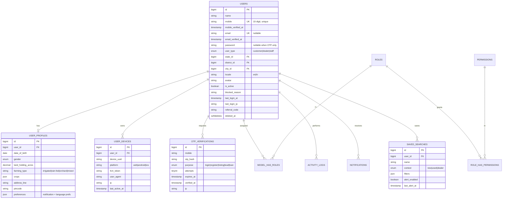

Also from Spatie: `roles`, `permissions`, `model_has_roles`, `model_has_permissions`, `role_has_permissions`.
Laravel defaults: `password_reset_tokens`, `sessions`, `personal_access_tokens`, `jobs`, `failed_jobs`, `cache`.

---

## 2. Geography

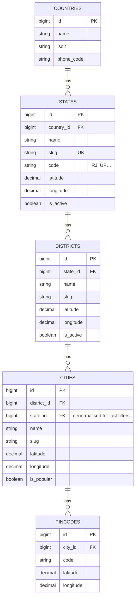

---

## 3. Catalogue core (products, brands, categories, specs)

A single polymorphic product core serves tractors, implements, harvesters, tyres and
farm tools. `category_id` decides which spec attributes apply — so a new machinery type
needs **zero** schema change.

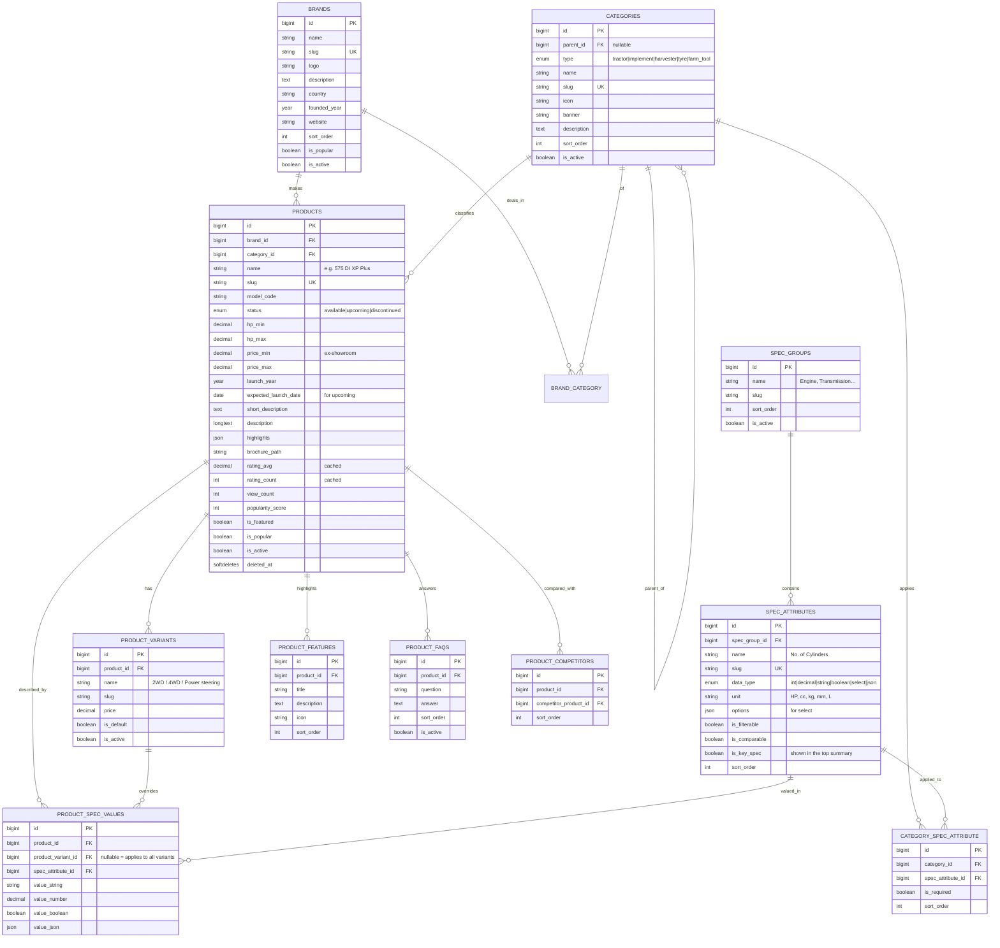

**Implement↔tractor compatibility** is derived from spec values
(`required_hp_min`, `required_hp_max`, `hitch_type`) — no extra table needed, with an
optional cache table `product_compatibilities (product_id, compatible_product_id)`
refreshed by a nightly job.

---

## 4. Pricing & media

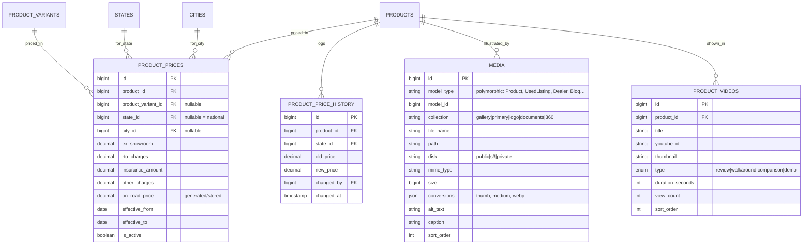

---

## 5. Used marketplace

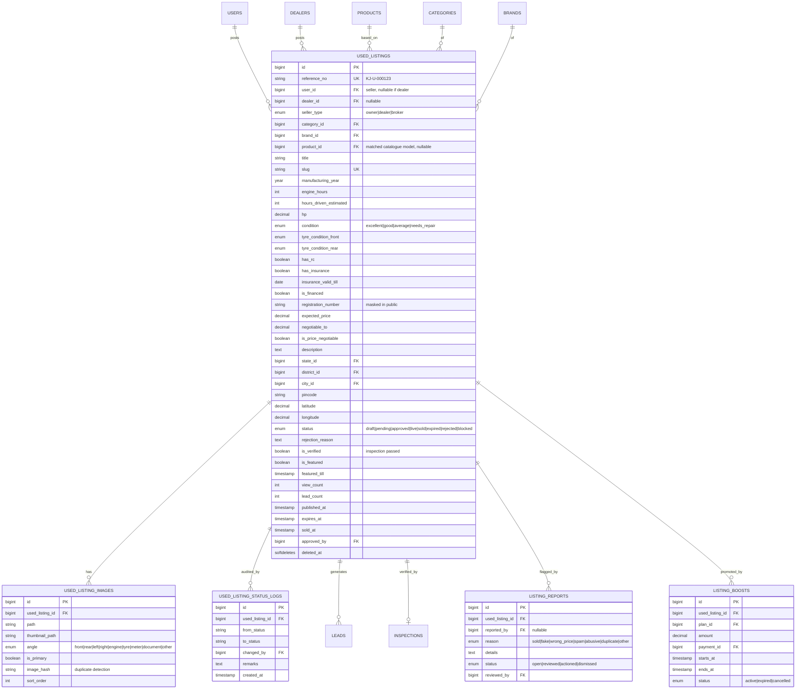

---

## 6. Inspection & valuation

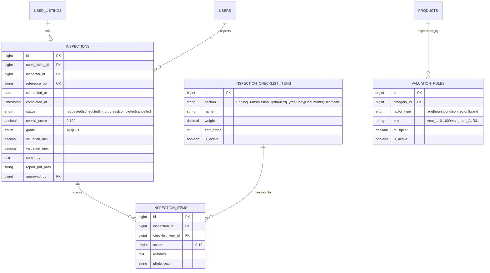

---

## 7. Dealers

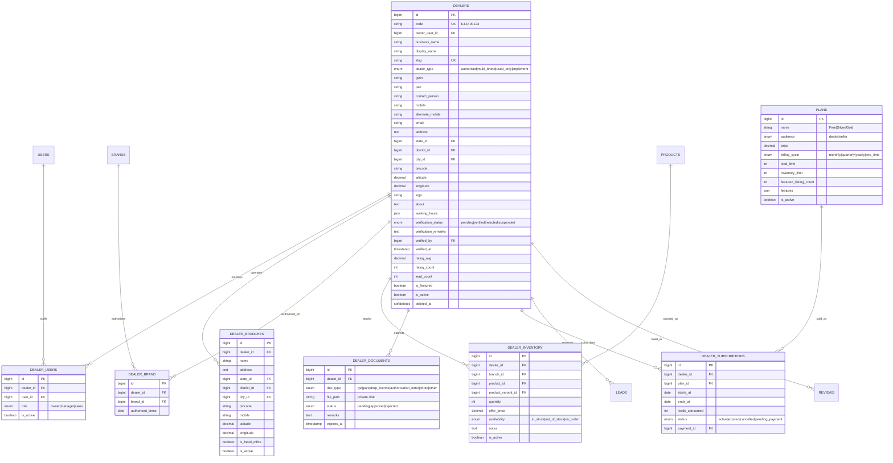

---

## 8. Leads & enquiries

One polymorphic lead table is the spine of the business.

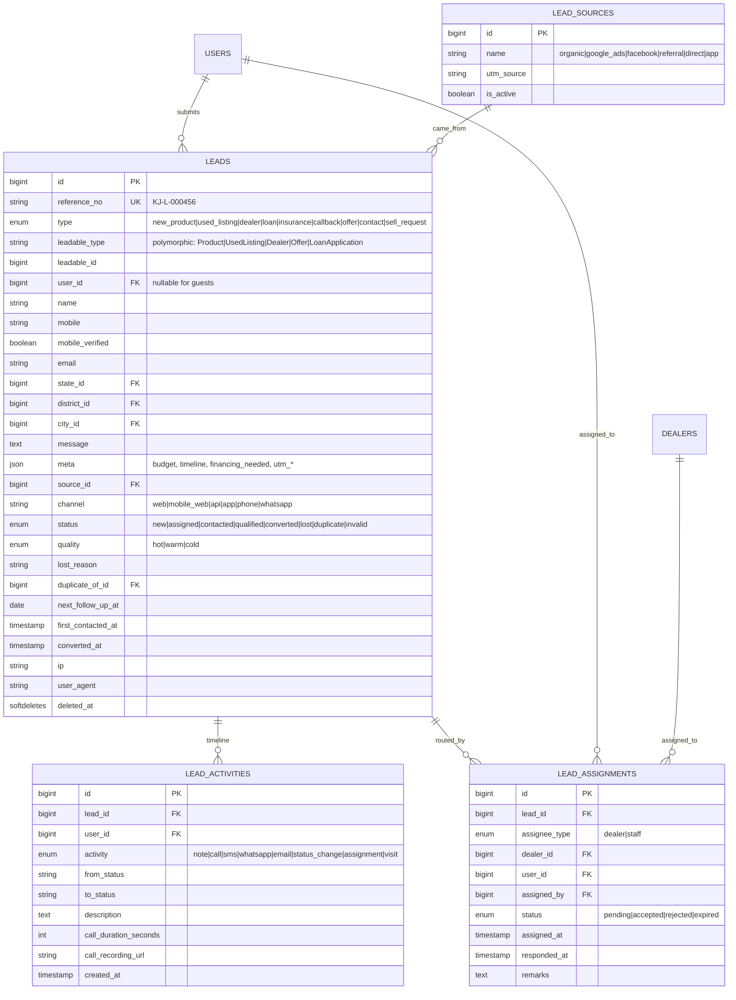

---

## 9. Finance & insurance

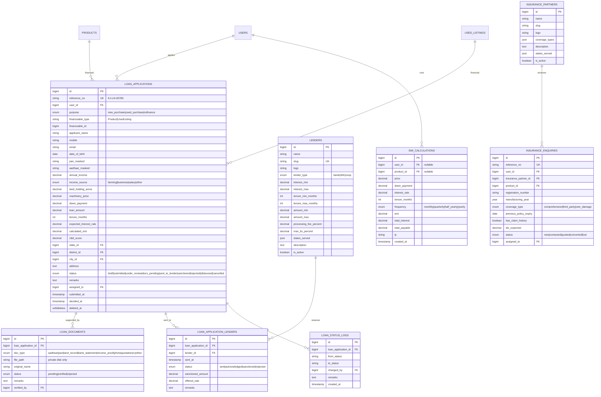

---

## 10. Reviews, compare, wishlist

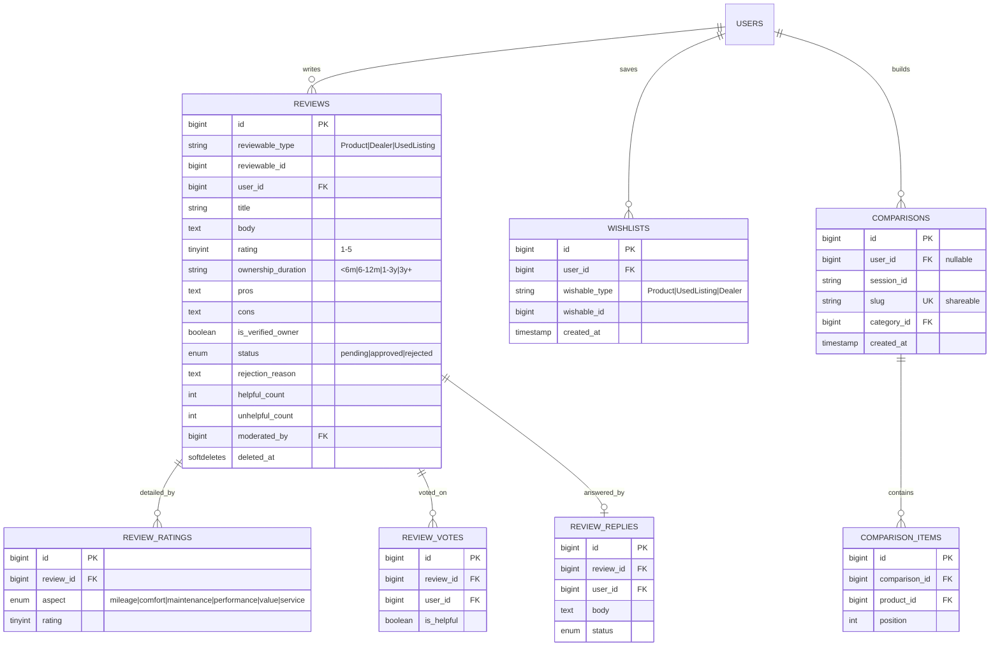

---

## 11. CMS, SEO & offers

```mermaid
erDiagram
    BLOG_CATEGORIES ||--o{ BLOGS : classifies
    USERS ||--o{ BLOGS : authors
    BLOGS ||--o{ BLOG_TAG : tagged
    TAGS ||--o{ BLOG_TAG : tags
    BLOGS ||--o{ BLOG_COMMENTS : discussed_in
    PAGES ||--o{ SEO_META : optimised
    PRODUCTS ||--o{ SEO_META : optimised
    OFFERS ||--o{ OFFER_PRODUCT : applies_to
    PRODUCTS ||--o{ OFFER_PRODUCT : discounted_in
    MENUS ||--o{ MENU_ITEMS : contains

    PAGES {
        bigint id PK
        string title
        string slug UK
        longtext content
        string template "default|contact|about|faq"
        boolean is_active
        boolean show_in_footer
        int sort_order
    }
    BLOG_CATEGORIES { bigint id PK  string name  string slug UK  string icon  int sort_order  boolean is_active }
    BLOGS {
        bigint id PK
        bigint blog_category_id FK
        bigint author_id FK
        enum type "blog|news|guide|press"
        string title
        string slug UK
        text excerpt
        longtext content
        string cover_image
        int reading_minutes
        int view_count
        boolean is_featured
        enum status "draft|scheduled|published|archived"
        timestamp published_at
        softdeletes deleted_at
    }
    TAGS { bigint id PK  string name  string slug UK }
    BLOG_TAG { bigint id PK  bigint blog_id FK  bigint tag_id FK }
    BLOG_COMMENTS { bigint id PK  bigint blog_id FK  bigint user_id FK  bigint parent_id FK  text body  enum status }
    VIDEOS {
        bigint id PK
        string title
        string slug UK
        string youtube_id
        string thumbnail
        bigint category_id FK
        bigint product_id FK "nullable"
        text description
        int duration_seconds
        int view_count
        boolean is_featured
        boolean is_active
    }
    FAQS { bigint id PK  string category "general|buying|selling|loan|dealer"  string question  text answer  int sort_order  boolean is_active }
    BANNERS {
        bigint id PK
        enum position "home_slider|home_mid|listing_top|sidebar|detail_bottom|app_promo"
        string title
        string subtitle
        string image_desktop
        string image_mobile
        string cta_text
        string cta_url
        enum device "all|desktop|mobile"
        date starts_at
        date ends_at
        int click_count
        int impression_count
        int sort_order
        boolean is_active
    }
    TESTIMONIALS { bigint id PK  string name  string designation  string city  string photo  text message  tinyint rating  boolean is_active  int sort_order }
    OFFERS {
        bigint id PK
        string title
        string slug UK
        text description
        bigint brand_id FK "nullable"
        enum discount_type "flat|percent|cashback|exchange|freebie"
        decimal discount_value
        string banner_image
        date starts_at
        date ends_at
        json states
        text terms
        int view_count
        boolean is_active
    }
    OFFER_PRODUCT { bigint id PK  bigint offer_id FK  bigint product_id FK }
    SEO_META {
        bigint id PK
        string seoable_type "Product|Page|Blog|Category|Brand|Dealer|UsedListing"
        bigint seoable_id
        string locale
        string meta_title
        text meta_description
        string meta_keywords
        string canonical_url
        string og_title
        text og_description
        string og_image
        string robots "index,follow"
        json schema_json
    }
    REDIRECTS { bigint id PK  string from_url UK  string to_url  smallint status_code "301|302"  int hit_count  boolean is_active }
    NOT_FOUND_LOGS { bigint id PK  string url  string referer  int hit_count  timestamp last_seen_at }
    MENUS { bigint id PK  string name "header|footer_1|footer_2|mobile"  string slug UK }
    MENU_ITEMS { bigint id PK  bigint menu_id FK  bigint parent_id FK  string label  string url  string icon  int sort_order  boolean is_active }
    NEWSLETTER_SUBSCRIBERS { bigint id PK  string email UK  string mobile  boolean is_active  timestamp unsubscribed_at }
    CONTACT_MESSAGES { bigint id PK  string name  string mobile  string email  string subject  text message  enum status "new|read|replied|closed"  bigint handled_by FK }
```

**Translations** — `translations (id, translatable_type, translatable_id, locale, field, value)`
covers content fields; UI strings live in `lang/{en,hi}/*.php` plus an admin-editable
`language_lines` table.

---

## 12. System, notifications & analytics

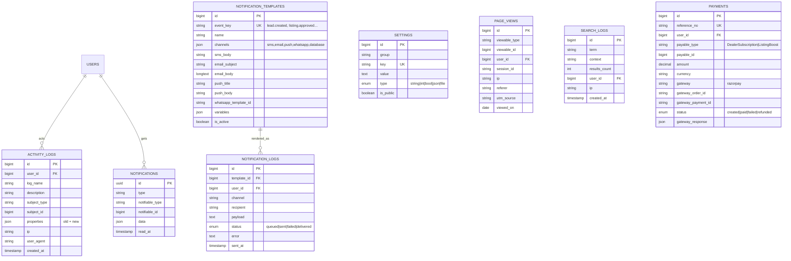

---

## 13. Master relationship overview

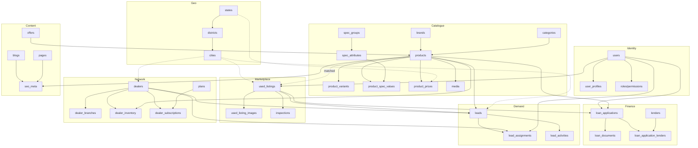

---

## 14. Key design decisions

| # | Decision | Rationale | Alternative rejected |
|---|---|---|---|
| D1 | **One `products` table + EAV specs** for tractors/implements/harvesters/tyres | New machinery types and new spec fields need no migration; admin adds attributes | Separate `tractors`, `implements`… tables → 5× duplicated CRUD & compare code |
| D2 | **Typed EAV columns** (`value_number`, `value_string`, `value_boolean`) rather than one text column | Numeric range filters (HP 40–50) stay index-able and fast | Single `value` varchar → no range queries |
| D3 | **Polymorphic `leads`** for all 9 enquiry types | One inbox, one routing engine, one report; new lead type = new enum value | Separate enquiry tables per feature |
| D4 | **`used_listings` separate from `products`** | Different lifecycle, ownership, moderation, expiry, and per-unit attributes | Reusing products with `is_used` flag → status/moderation pollution |
| D5 | **Price rows are geo + date scoped** with history | On-road price differs by state and changes often; SEO pages need "price in <city>" | Single price column on product |
| D6 | **Spatie permission tables**, single `users` table with `user_type` + guards | One identity, many panels; a dealer owner is still a user | Separate `admins`/`dealers` auth tables → duplicated auth code |
| D7 | **Polymorphic `media`, `seo_meta`, `reviews`, `wishlists`** | Uniform handling across all entity types | Per-entity image/SEO tables |
| D8 | **Cached aggregates** (`rating_avg`, `view_count`, `lead_count`) on parent rows | Listing pages must not COUNT() per row | Compute on read |
| D9 | **KYC/loan docs on a private disk** with signed URLs, PAN/Aadhaar stored masked | DPDP compliance; a public URL leak is unacceptable | Public storage |
| D10 | **Status enums + `*_status_logs` tables** for listings, leads, loans | Auditable, disputable state machines | Status column only |
| D11 | **`reference_no` human IDs** (KJ-L-000456) alongside PKs | Call-centre and WhatsApp support | Exposing raw incrementing IDs |
| D12 | **Soft deletes** on users, products, listings, leads, dealers, blogs | Business data is never truly deleted; audit + restore | Hard delete |

---

## 15. Index & performance plan

| Table | Indexes |
|---|---|
| `products` | `(brand_id, status)`, `(category_id, status)`, `slug` UK, `(is_popular, popularity_score)`, FULLTEXT(`name`) |
| `product_spec_values` | `(spec_attribute_id, value_number)`, `(product_id, spec_attribute_id)` UK-ish, `(spec_attribute_id, value_string(50))` |
| `product_prices` | `(product_id, state_id, is_active)`, `(state_id, effective_from)` |
| `used_listings` | `(status, published_at)`, `(state_id, district_id, status)`, `(brand_id, category_id, status)`, `(expected_price)`, `(manufacturing_year)`, `(latitude, longitude)`, `slug` UK, `(user_id, created_at)` |
| `leads` | `(type, status, created_at)`, `(leadable_type, leadable_id)`, `(mobile)`, `(district_id, status)`, `(next_follow_up_at)` |
| `lead_assignments` | `(dealer_id, status)`, `(user_id, status)`, `(lead_id)` |
| `dealers` | `(state_id, district_id, verification_status)`, `slug` UK, `(latitude, longitude)`, `(is_featured, rating_avg)` |
| `dealer_inventory` | `(dealer_id, product_id)` UK, `(product_id, availability)` |
| `loan_applications` | `(status, submitted_at)`, `(user_id)`, `(assigned_to, status)`, `reference_no` UK |
| `reviews` | `(reviewable_type, reviewable_id, status)`, `(user_id)` |
| `media` | `(model_type, model_id, collection)` |
| `seo_meta` | `(seoable_type, seoable_id, locale)` UK |
| `page_views` | `(viewable_type, viewable_id, viewed_on)` — partitioned/archived monthly |
| `activity_logs` | `(subject_type, subject_id)`, `(user_id, created_at)` — archived quarterly |

**Caching:** Redis for filter facets (15 min), home-page blocks (30 min), model detail
fragments (60 min), spec attribute definitions (24 h), geography (24 h). Cache tags
invalidated by model observers.

**Search:** Laravel Scout → Meilisearch indexes for `products`, `used_listings`,
`dealers`, `blogs` with synonyms (mahindra/महिंद्रा) and typo tolerance.

---

## 16. Seed data plan (phase 1)

| Table | Seeded rows |
|---|---|
| countries/states/districts/cities | 1 / 36 / ~780 / ~4 000 |
| brands | 25 |
| categories | ~45 (tractor 8, implement 25, harvester 4, tyre 3, farm tool 5) |
| spec_groups / spec_attributes | 12 / ~120 |
| products (demo) | ~60 tractors + ~40 implements |
| product_prices | national + 10 major states per product |
| lenders / insurance_partners | 12 / 6 |
| plans | 3 dealer + 2 seller |
| roles / permissions | 10 / ~180 |
| settings | ~60 keys |
| notification_templates | ~25 events |
| faqs / pages | 30 / 6 |
