# Krishi Junction — User Flows & Process Diagrams

Every flow below is a build contract: the screens, states and side-effects named here are
what will be implemented.

- [0. High-level system flow](#0-high-level-system-flow)
- [1. Buyer — new tractor discovery → enquiry](#1-buyer--new-tractor-discovery--enquiry)
- [2. Buyer — used tractor purchase](#2-buyer--used-tractor-purchase)
- [3. Seller — list a used tractor](#3-seller--list-a-used-tractor)
- [4. Moderation — used listing approval](#4-moderation--used-listing-approval)
- [5. Inspection & verified badge](#5-inspection--verified-badge)
- [6. Lead capture → routing → closure](#6-lead-capture--routing--closure)
- [7. Loan application lifecycle](#7-loan-application-lifecycle)
- [8. EMI calculator](#8-emi-calculator)
- [9. Dealer onboarding & dealer panel](#9-dealer-onboarding--dealer-panel)
- [10. Authentication (OTP)](#10-authentication-otp)
- [11. Comparison flow](#11-comparison-flow)
- [12. Admin catalogue publishing](#12-admin-catalogue-publishing)
- [13. Review moderation](#13-review-moderation)
- [14. Notification dispatch](#14-notification-dispatch)
- [15. State machines](#15-state-machines)

---

## 0. High-level system flow

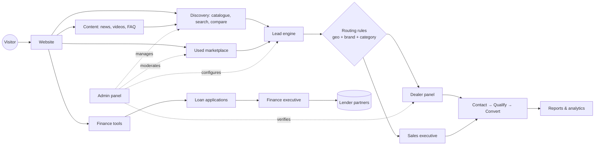

---

## 1. Buyer — new tractor discovery → enquiry

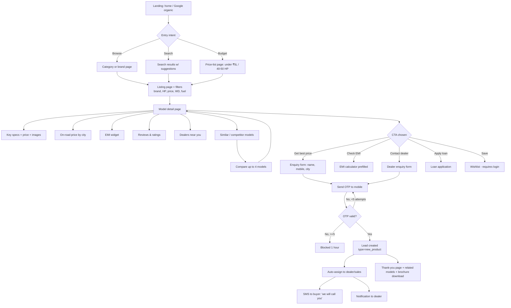

---

## 2. Buyer — used tractor purchase

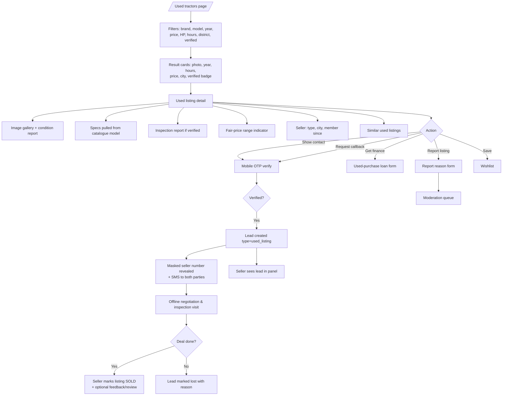

---

## 3. Seller — list a used tractor

Target: **under 3 minutes on a phone.**

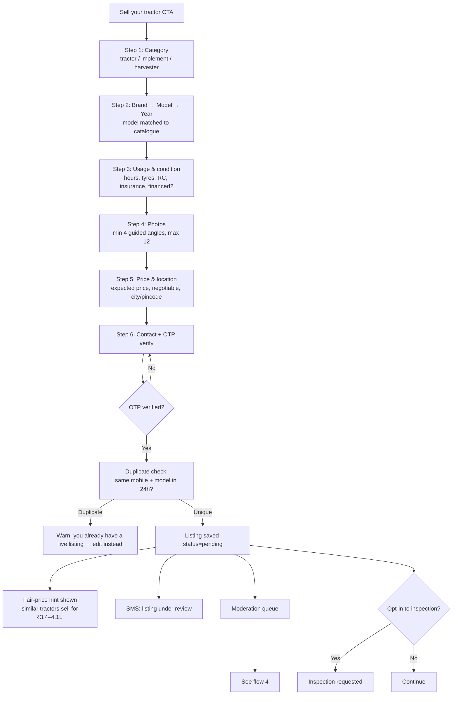

Autosave keeps a `draft` at every step so an interrupted seller can resume from a link.

---

## 4. Moderation — used listing approval

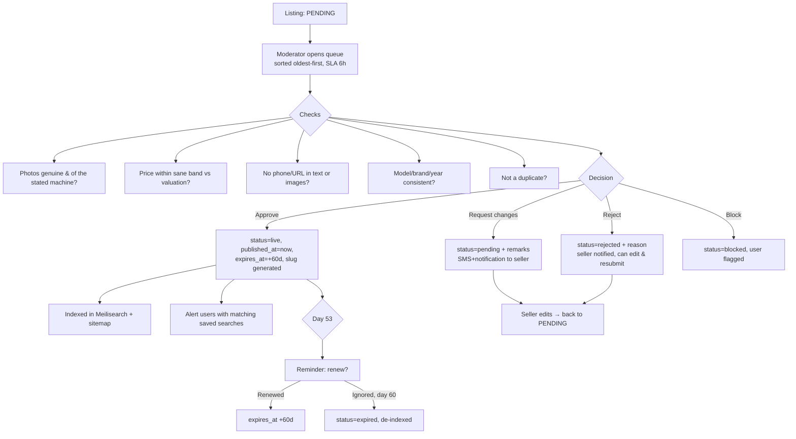

---

## 5. Inspection & verified badge

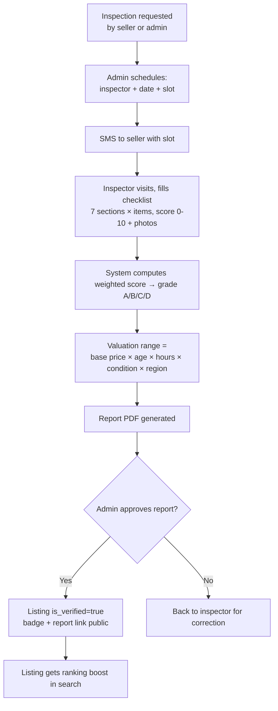

---

## 6. Lead capture → routing → closure

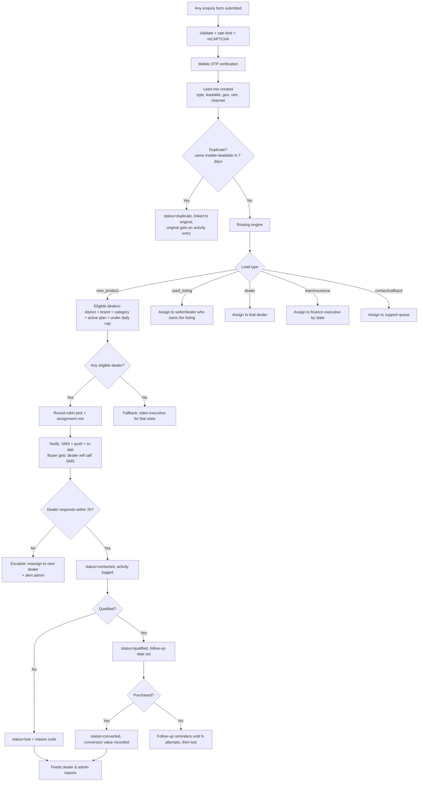

---

## 7. Loan application lifecycle

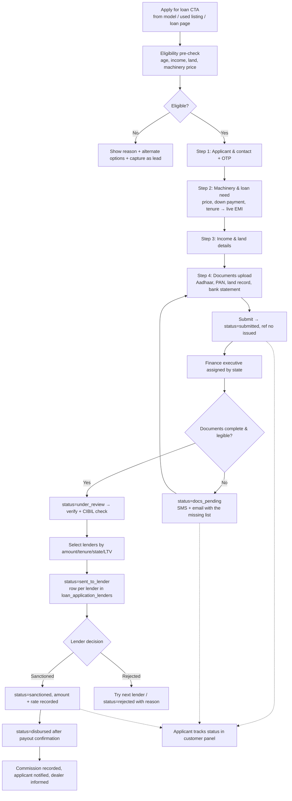

---

## 8. EMI calculator

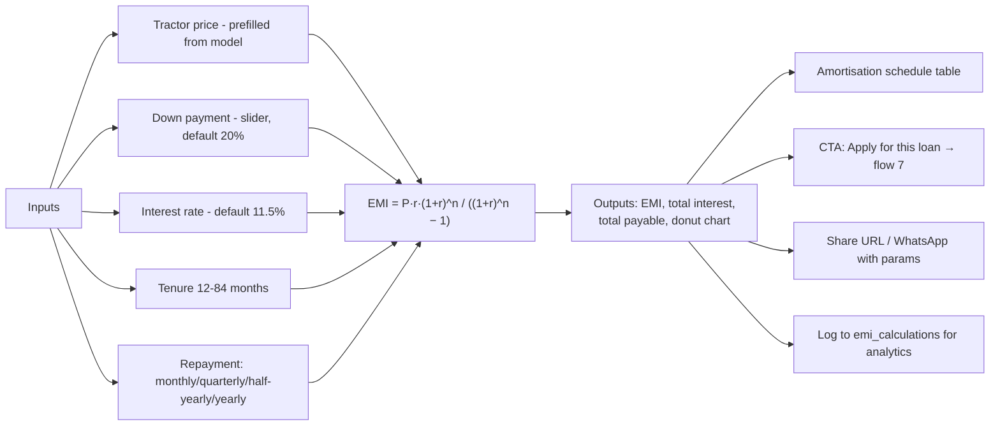

---

## 9. Dealer onboarding & dealer panel

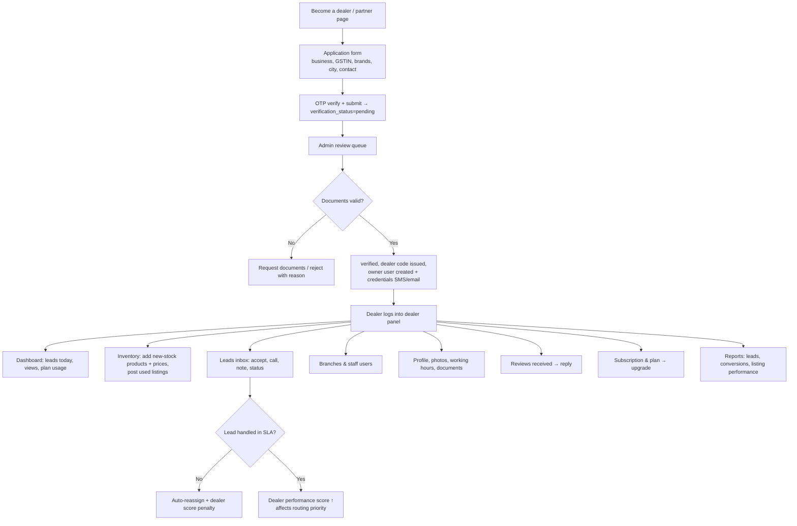

---

## 10. Authentication (OTP)

```mermaid
sequenceDiagram
    autonumber
    participant U as User
    participant W as Web/App
    participant API as Laravel
    participant SMS as SMS gateway
    participant DB as MySQL/Redis

    U->>W: Enters 10-digit mobile
    W->>API: POST /auth/otp/send
    API->>API: Validate format, rate-limit (5/hr/mobile, 20/hr/IP)
    API->>DB: Store otp_hash + expires_at (10 min)
    API->>SMS: Send 6-digit OTP
    SMS-->>U: SMS delivered
    U->>W: Enters OTP
    W->>API: POST /auth/otp/verify
    API->>DB: Compare hash, check expiry & attempts
    alt Valid
        API->>DB: Find or create user, set mobile_verified_at
        API-->>W: Session (web) or Sanctum token (app)
        W-->>U: Redirect to intended action
    else Invalid
        API->>DB: attempts++
        API-->>W: Error; block after 5 attempts for 1 hour
    end
```

---

## 11. Comparison flow

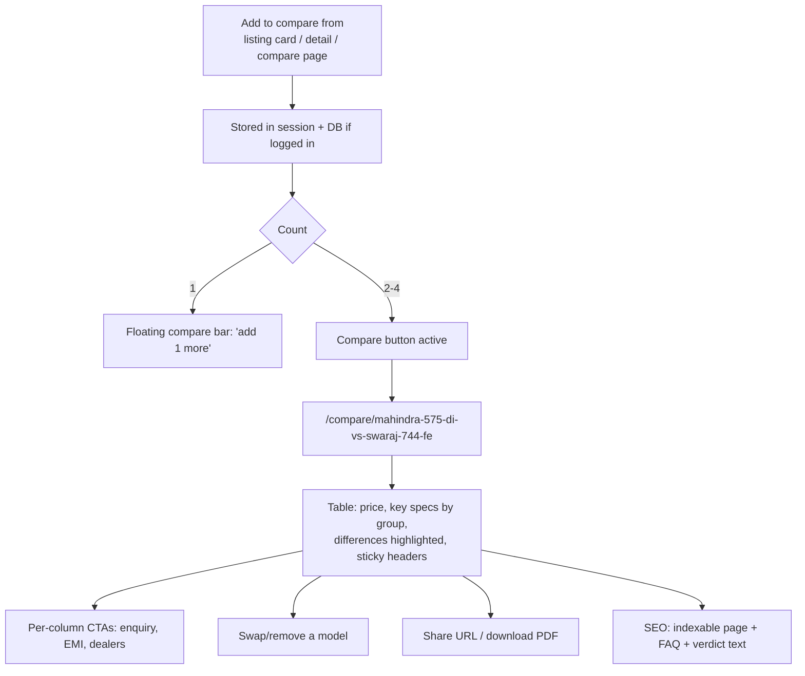

---

## 12. Admin catalogue publishing

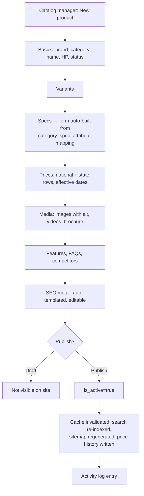

---

## 13. Review moderation

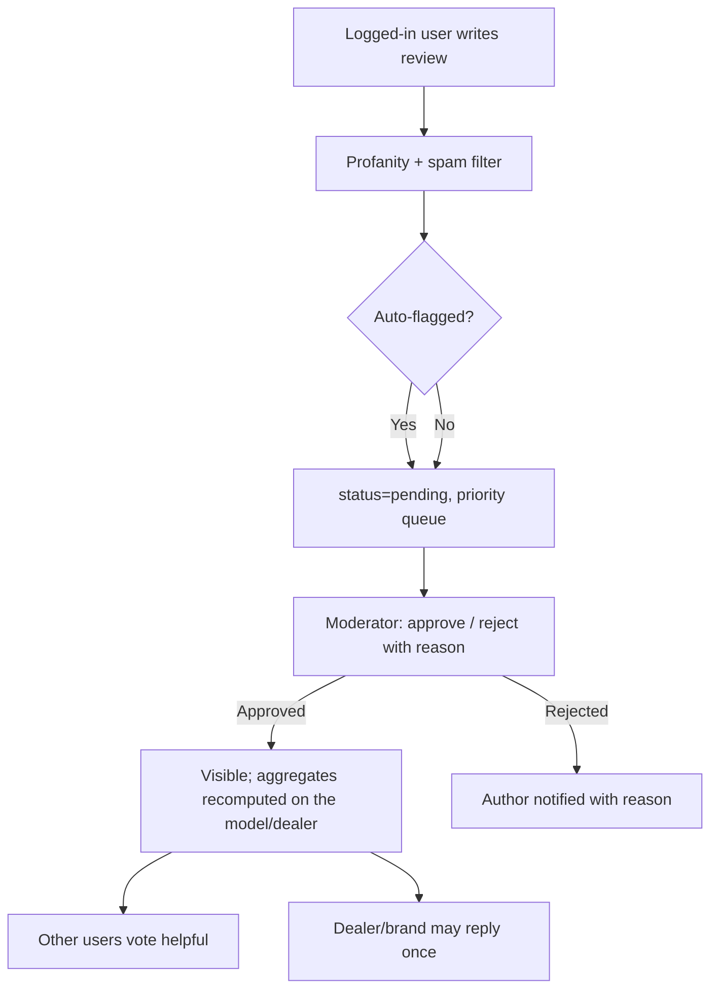

---

## 14. Notification dispatch

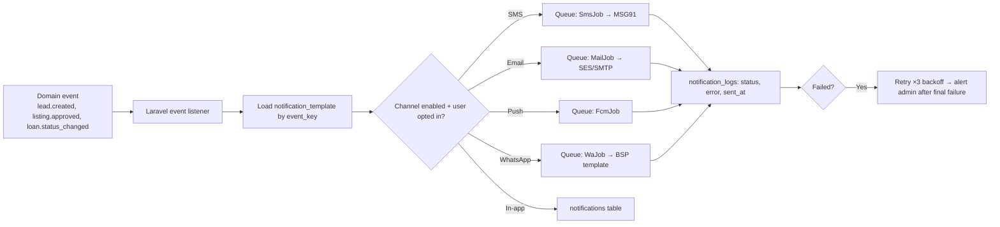

---

## 15. State machines

### Used listing
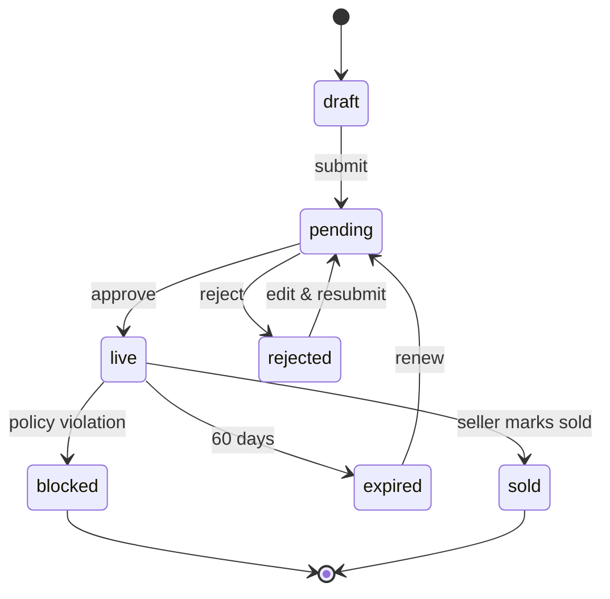

### Lead
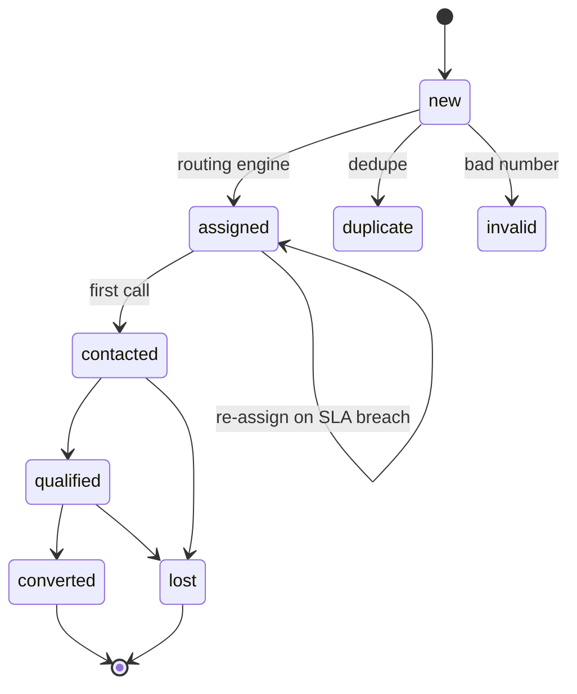

### Loan application
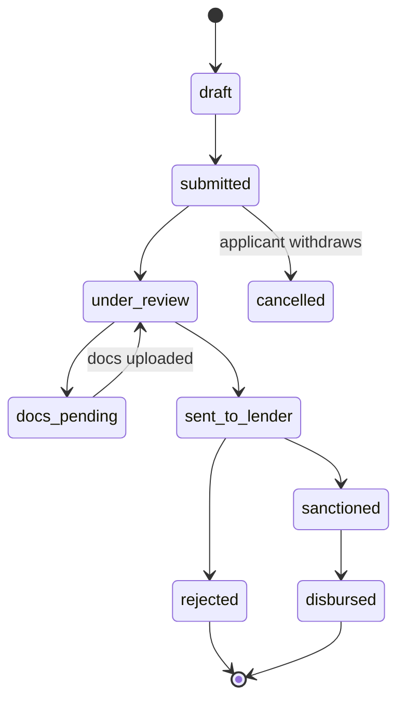

### Dealer
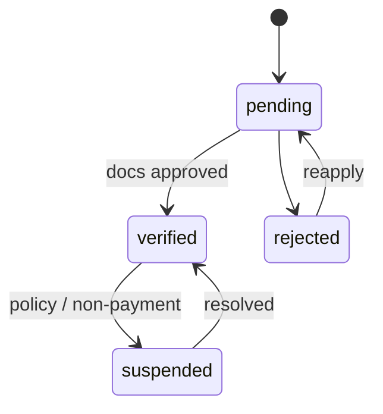
